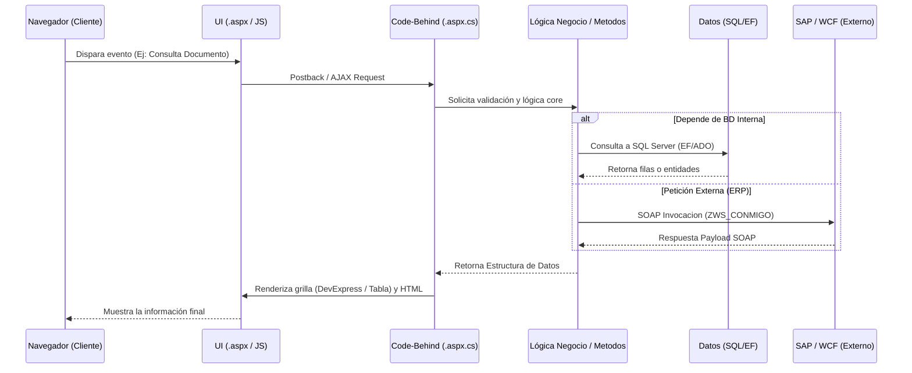

# WebVentas - Guía Definitiva de Onboarding

¡Bienvenido al equipo de desarrollo! 

Este documento, **WebVentas**, ha sido redactado desde cero pensando en tu integración rápida y eficiente al proyecto. Aquí encontrarás toda la información pertinente desde el momento que clonas el repositorio hasta entender cómo fluyen los datos en la arquitectura del sistema.

## 📖 Título y Descripción General

**WebVentas** es un sistema integral de gestión y facturación, diseñado principalmente para agilizar los flujos comerciales, manejo de documentos, recibos empresariales y reportes operacionales.

El proyecto permite la interacción con diferentes orígenes de datos (bases de datos y ERPs como SAP), la gestión de usuarios empresariales (Mesa de Partes, Recibos, Tomadores, etc.), y proporciona reportes detallados tanto operacionales como tributarios (SUNAT). Está pensado para resolver y centralizar el ciclo de vida de la fuerza de venta/documentos en una arquitectura robusta orientada a la web clásica.

---

## 🎯 Características Principales (Features)

* **Autenticación e Identidad:** Soporte integrado vía `Microsoft.AspNet.Identity` y SSO (SAML/Owin), con opciones de Google Authenticator.
* **Módulos Core:**
  * `Formulario/`: Motor de formularios dinámicos y principales flujos de negocio.
  * `Documentos/`: Módulo de gestión documental (Mesa de partes, recibos temporales, integración con plataformas externas).
  * `Reportes y Operaciones/`: Interfaces enfocadas en cierres de caja (Listado Web, Listado Móvil) e impresión unificada de reportes PDF (via `Rpt/` y Handlers `.ashx`).
* **Integración ERP y Externa:** Consumo de APIs Web (REST) y Endpoints SOAP (WCF) hacia sistemas como SAP (`ZWS_MATMIGO`, `ZWS_CONMIGO`), servicios de pre-cuentas e impresiones centralizadas remotas.
* **Experiencia de Usuario:** Interfaz gráfica apoyada con controles *DevExpress v19.2*, *jQWidgets* y *Bootstrap 3*, con modos de visualización adaptativos a Web y Móvil.

---

## 🛠 Stack Tecnológico

La aplicación está cimentada en el ecosistema Microsoft clásico, aprovechando su madurez y estabilidad:

* **Lenguaje:** C# 
* **Framework Backend:** .NET Framework 4.8
* **Tipo de Proyecto:** ASP.NET Web Forms y Web API
* **Base de Datos / ORM:** Entity Framework 6.5.1 y ADO.NET (Acceso a SQL Server y Oracle `OraOLEDB.Oracle`).
* **Frontend:** 
  * HTML5, CSS3, JavaScript
  * Bootstrap 3.3.7, jQuery 3.1.1
  * DevExpress v19.2 (Controles Web complejos y grillas)
  * jQWidgets (Componentes ricos de interfaz)
* **Otros Nugets y Librerías destacadas:**
  * `Newtonsoft.Json`: Procesamiento de datos JSON.
  * `RestSharp`: Clientes HTTP REST.
  * `QRCoder` y `QrCode.Net`: Generación de código QR.
  * `AspNetSaml` e `Identity`: Sistema integral de Seguridad y Control de Accesos.

---

## 🏗 Arquitectura del Sistema

La estructura sigue un modelo de **Arquitectura Multicapas (Monolítica Típica de Web Forms)**, donde se segregan las responsabilidades aunque convivan en un mismo ensamblado o solución.

### Flujo y Capas de la Aplicación

1. **Capa de Presentación (UI):** Correspondiente a los archivos `.aspx` (código de cliente HTMl/JS/DevExpress). La responsividad se delega a hojas de estilo como `defaultstylesMovil.css`.
2. **Capa de Lógica de Presentación / Controladores (Code-Behind):** Los archivos `.aspx.cs` procesan los eventos de la UI, construyen la página y delegan el trabajo intensivo a reglas de negocio centralizadas. Los Handlers genéricos (`.ashx`) controlan la emisión directa de blobs como PDFs.
3. **Capa de Negocio (BLL) y Modelos (Models):** Las reglas validan condiciones de empresa/multitenant, interactuando con los namespaces internos y ensamblados de utilidades (ej. `Metodos.cs`).
4. **Capa de Acceso a Datos (DAL) e Integración Externa:** Compuesta por `Entity Framework` para acceso relacional mapeado, ADO.NET clásico y clientes WCF configurados en `system.serviceModel` para comunicarse con los SAP WebServices o microservicios externos.

### Mapa del Flujo de Datos



---

## 📂 Estructura del Proyecto

A continuación te explicamos las carpetas cardinales del repositorio:

* 📁 **`Account/`** : Lógica y páginas asociadas al modelo de seguridad de ASP.NET Identity (Login, registro, recuperación).
* 📁 **`App_Data/`** : Ficheros de datos empotrados de la aplicación (bases de datos locales si aplica o XMLs temporales).
* 📁 **`App_Start/`** : Registros de inicialización (Identity, Rutas para URL amigables, Bundles de optimización CSS/JS).
* 📁 **`Connected Services/`** : Referencias locales WCF e integraciones de proxy a los endpoints externos (ej., `srvAustral`, utilidades de SAP).
* 📁 **`Content/`**, 📁 **`Scripts/`**, 📁 **`fonts/`**, 📁 **`styles/`**, 📁 **`jqwidgets/`**: Archivos estáticos agrupando el ecosistema Frontend.
* 📁 **`Documentos/`** & 📁 **`Formulario/`**: **Core del sistema.** `Formulario` abarca miles de archivos relacionados con las lógicas comerciales, y `Documentos` abarca las subidas/gestiones (Mesa de Partes).
* 📁 **`Models/`** : Clases de Entidades de Base de Datos y Modelos de vista de Dominio.
* 📁 **`Rpt/`** : Reportes compilados de tipo `rdlc` o `Crystal/DevExpress` para la generación de PDFs.
* 📄 **`Global.asax`** : Intercepción del ciclo de vida de la aplicación Web, compresión GZip/Deflate y RouteConfigs.
* 📄 **`Web.config`** : Reglas de firewall, connection strings multi-empresa (SQL Server variados, Oracle) y endpoints SOA.

---

## 🚀 Guía de Configuración Local (Setup)

Sigue estos pasos para levantar el entorno de desarrollo en tu máquina.

### 1. Prerrequisitos de Sistema

* **IDE:** Microsoft Visual Studio 2019 o superior (2022 es recomendado) con carga de trabajo `"Desarrollo de ASP.NET y web"`.
* **SDK:** .NET Framework 4.8 Developer Pack instalado.
* **Componentes Exclusivos:** Se requiere tener instalado **DevExpress v19.2** for WebForms, o tener las DLLs licenciadas enrutadas correctamente para compilar los controles.

### 2. Pasos para la Inicialización

1. **Clonar el proyecto:**
   Abre una consola (o Git Bash) en tu directorio base y clona:
   ```bash
   git clone [URL_DEL_REPOSITORIO]
   cd WebVentas
   ```

2. **Restaurar Paquetes NuGet:**
   Abre la solución `WebApp02.v11.suo` (o `TwoTecnology.WebVentas.csproj`) con Visual Studio.
   Ve a `Herramientas > Administrador de paquetes NuGet > Consola ...` e ingresa:
   ```powershell
   Update-Package -reinstall
   ```
   También puedes usar la opción de "Restaurar paquetes NuGet" dando clic derecho sobre la solución.

3. **Verificar el `Web.config` (Cadenas de Conexión):**
   Existen diversas cadenas configuradas (`dbventas`, `dbsunat`, `dbreporte`, etc.). El proyecto soporta ambientes aislados comentando y descomentando nodos XML (`<!-- -->`).
   *Asegúrate de coordinar con el arquitecto o jefe de equipo cuál bloque XML de base de datos utilizar para Desarrollo (usualmente marcados como pruebas o apuntando a servidores IP terminados en `.26` o `.69`).*

4. **Directorios Locales requeridos:**
   Revisa las llaves (AppSettings) en el `Web.config` para directorios que el sistema asume que existen. Podrías necesitar crear carpetas temporales:
   * `C:\inetpub\wwwroot\Images\productos\`
   * `D:\GestorDocumentos`
   * `D:\Temporal`

5. **Compilar y Ejecutar:**
   Selecciona el compilador en modo `Debug` en `WebForms` presionando `F5` o el botón "Iniciar" en Visual Studio. Selecciona **IIS Express** por defecto si usas VS.
   El sistema debería abrirse por defecto en `Default.aspx`.
  
¡Mucho éxito en tus primeros aportes a la plataforma! Si es tu primer ticket o requerimiento, no dudes en mapear la cadena de dependencias observando el tab _"Referencias"_ en el proyecto. 

---

## 🌱 Nueva Aplicación (Clean Architecture)

Actualmente, el proyecto se encuentra en un proceso de migración hacia una nueva arquitectura limpia (Clean Architecture) utilizando **.NET 8+**. El nuevo código base se encuentra en el directorio `WebVentas.Core`.

Para ejecutar esta nueva aplicación (API REST):

### Prerrequisitos
- **.NET 8 SDK** instalado.
- Opcionalmente, herramientas de Entity Framework Core instaladas para gestionar la base de datos (`dotnet tool install --global dotnet-ef`).
- Visual Studio 2022 o VS Code.

### Pasos detallados para ejecutar:

1. **Abre una terminal** en la raíz del proyecto y navega al directorio del backend:
   ```bash
   cd WebVentas.Core
   ```

2. **Configuración de la Base de Datos**:
   Asegúrate de revisar el archivo `appsettings.json` o `appsettings.Development.json` dentro de `WebVentas.Core.API` para verificar que la cadena de conexión bajo la llave `"WebVentas.Core"` apunte a tu entorno local o de desarrollo (por defecto, configurada hacia el servidor `37.187.141.26,11432` con la base de datos `ventas_v2`).

3. **Restaurar y compilar** la solución completa:
   ```bash
   dotnet restore
   dotnet build
   ```

4. **Ejecutar la API**:
   Navega al proyecto responsable de recibir peticiones (API) y arranca la aplicación:
   ```bash
   cd WebVentas.Core.API
   dotnet run
   ```

5. **Probar la Aplicación**:
   Una vez iniciado, visita la URL indicada en la consola (usualmente `http://localhost:5273`) para acceder a la interfaz Swagger, donde podrás explorar y testear los nuevos endpoints. La URL te reedirigirá automáticamente.

Para más detalles sobre la estructura de la nueva arquitectura, consulta el [README de WebVentas.Core](WebVentas.Core/README.md).
